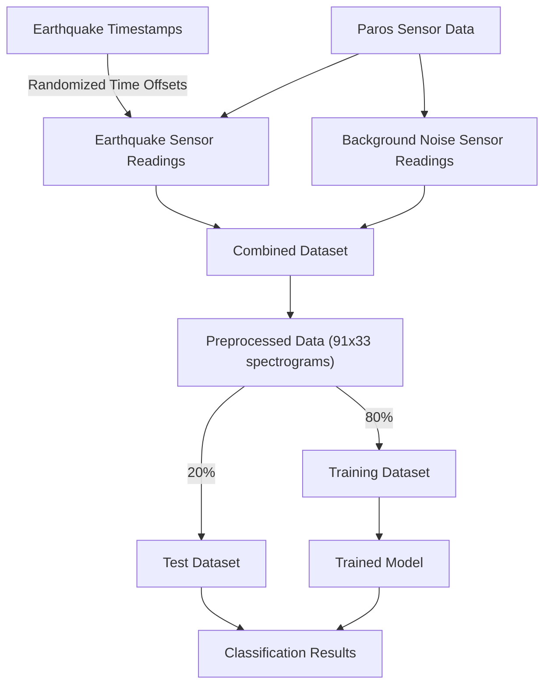

# Earthquake Infrasound Classifier
Suite of scripts and utilities for training, evaluating, and deploying deep learning models to classify infrasonic data as earthquake-generated or background noise.

## Setup
Clone this repo and install dependencies in a virtual environment:
```bash
python3 -m venv .venv
source .venv/bin/activate
pip install -r requirements.txt
```
### Paros API Config
To use Paros sensor data hosted on InfluxDB, configure the source in `sensor_config.json`. Defaults (sans password) are filled in for `parost2`.
```json
{
  "box_id": "parost2",
  "sensor_id": "141929",
  "password": "******",
  "sample_rate_hz": 20
}
```

### Earthquake Event List
A list of earthquake events located at `data/EarthQuakeData.csv` is used to generate training and evaluation datasets. Sensor data temporally proximate to earthquake times (compensated for propagation delay) is used to populate the earthquake class.

Generate a CSV at https://earthquake.usgs.gov/earthquakes/search/.

## Usage
Top level scripts are located in `/scripts` and can be run from the command line.

### 0. Parameters
Tuning parameters for the pipeline can be found in `scripts/constants.py`.

### 1. Data Generation
Run the following script to pull data from InfluxDB, run [preprocessing](#data-preprocessing), and store for use in training:
```bash
python -m scripts.record_data
```
Files will be generated in `/data` in the form of `.pkl` files.

### 2. Model Training
The [current model](#model) combines a convolutional neural net for learning signal shape and a linear component for incorporating power metrics. Code for the model can be found in [`cnn_utils.py`](pipeline/cnn_utils.py).

To run training use:
```bash
python -m scripts.train
```
A `.pth` file containing model weights and a `.npz` storing normalization info will be stored in `/data/model`.

### 3. Evaluation
To train evaluate the model against a data range, run:
```bash
python -m scripts.train
```
Start and end times can be modified in the script. Results will be saved as CSV files in `/data/output`.

### 4. Viewer
The viewer can be used to visualize data from a provided time range. The only mandatory argument is a start time for the data range. By default the length of the window will match what's specified in [`constants.py`](scripts/constants.py), but can be overridden by the `--duration` or `--end_time` flags.

For example, if you wanted to plot 120 seconds of data starting at 23:58:01 UTC on 4/2/2024, you would run the following command:
```bash
python -m scripts.view 2024-04-02T23:58:01 --duration 120
```

## Pipeline Overview

### Data Preprocessing
Most parameters for data preprocessing can be found in [`constants.py`](scripts/constants.py). Waveforms from the Paros sensor are detrended, filtered through a tapered-cosine window, and passed through a high-pass filter. Next a spectrogram is then created plotting frequencies from 1 Hz to 10 Hz, log-scaled, and saved.

The [viewer](#4-viewer) is useful for visualizing model inputs.

### Model
The model has two components: a primary convolutional net based on the model described in [this paper](https://doi.org/10.1029/2018GL081119 ) from Sandia National Laboratories, and a secondary multilayer perceptron. Log-scaled spectrograms are passed through the CNN, while the MLP processes an array representing the relative power of various frequency bands in the signal. A classification head then produces the final confidence of an earthquake event.
